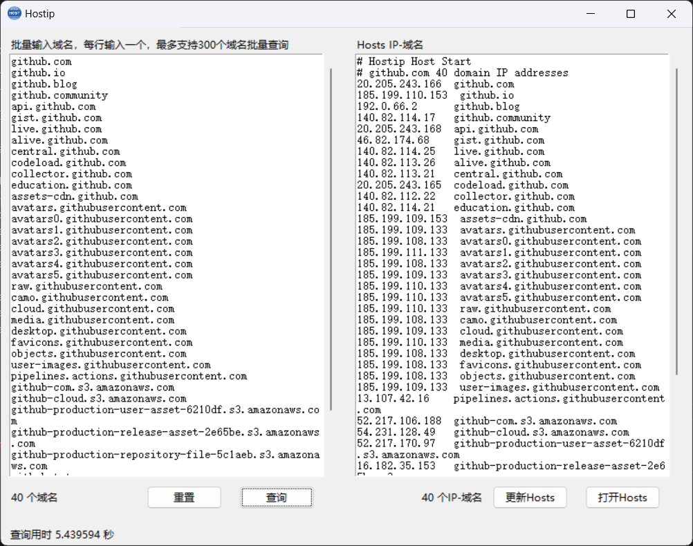

<div align="center">

# Hostip

  <p><strong>Batch Query IP Addresses for Domains and Generate Hosts File</strong></p>

English | [简体中文](./README_ZH-CN.md)

</div>

Hostip is an open-source tool for batch querying IP addresses for domains and generating Hosts files. It provides a simple graphical user interface that allows users to input multiple domains and quickly query their IP addresses, which are then saved as Hosts files on their computer.

## Screenshots



## Key Features

- Batch query IP addresses for domains.
- Supports various domain formats and automatically filters out invalid domains.
- Saves query results as Hosts files for convenient local Hosts file updates.
- Supports text operations like undo, redo, cut, copy, paste, delete, and provides a context menu for quick actions.

## Installation and Execution

To run Hostip, you need the following dependencies:

- Python 3.x
- Tkinter library

Install the Tkinter library:

```bash
pip install tk
```

Then, download the source code for Hostip and run it:

```bash
python main.py
```

## Download Latest Version

You can download the latest version of Hostip from the following link:

[Download Hostip](https://github.com/hawflying/hostip/releases)

## Compile to an Executable

You can also compile Hostip into a standalone executable for easier distribution. Here are the steps to compile Hostip as an executable:

1. Install PyInstaller:

```bash
pip install pyinstaller
```

2. Compile Hostip using PyInstaller:

```bash
pyinstaller -F main.py -n Hostip --add-data 'icon.ico;.' -i icon.ico -w
```

3. After compilation, you will find an executable file named Hostip in the generated dist directory. Users can double-click this executable to run the Hostip application without the need to install Python or other dependencies.

## Usage Instructions

1. Input Domains: Enter the domains you want to query in the text box, one domain per line. Hostip will automatically filter out invalid domains.
2. Query: Click the "Query" button to start querying the IP addresses for the domains. The query results will be displayed in the text box on the right.
3. Update Hosts File: If you need to update your local Hosts file, click the "Update Hosts" button. Hostip will save the query results as a Hosts file and update it.
4. Open Hosts File: Click the "Open Hosts" button to open the Hosts file on your computer.

## Notes
- Use the Hosts file update feature with caution and make sure you understand how Hosts files work.
- Keep in mind that the query results will overwrite the existing Hosts file, so make a backup of the Hosts file if necessary.

## Contributing

If you find bugs or have suggestions for improvements, feel free to contribute to this project. You can:

1. Submit an Issue to report problems.
2. Submit a Pull Request to enhance the code.