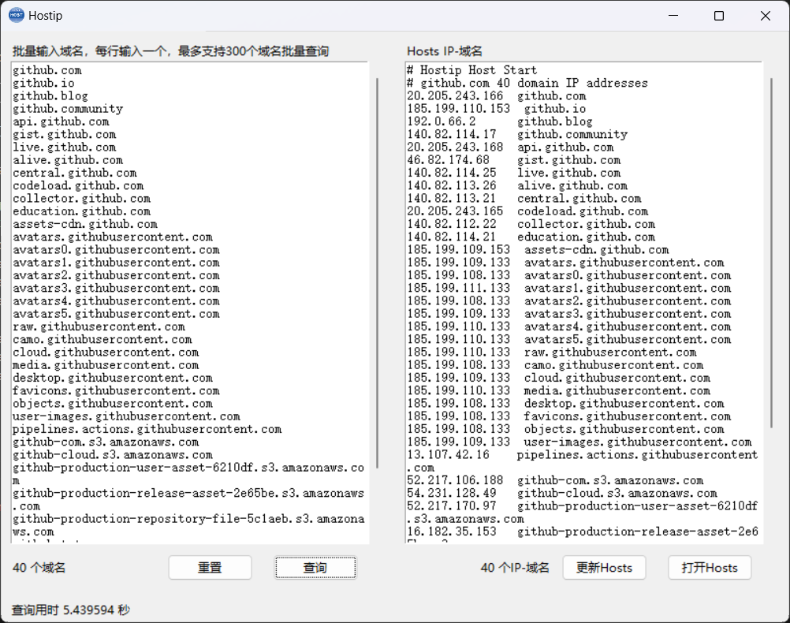

<div align="center">

# Hostip

  <p><strong>批量查询域名对应的IP地址并生成Hosts文件</strong></p>

[English](./README.md) | 简体中文
</div>

Hostip是一个用于批量查询域名对应的IP地址并生成Hosts文件的开源工具。它提供了一个简单的图形用户界面，允许用户输入多个域名，并一键查询它们的IP地址，然后将查询结果以Hosts文件的形式保存到计算机上。

## 屏幕截图



## 功能特点

- 批量查询域名对应的IP地址。
- 支持多种域名格式，自动过滤非法域名。
- 查询结果以Hosts文件形式保存，方便用于本地Hosts文件的更新。
- 支持撤销、恢复、剪切、复制、粘贴、删除等文本操作。
- 提供右键菜单快捷操作功能。

## 安装与运行

要运行Hostip，您需要以下依赖：

- Python 3.x
- Tkinter库

安装Tkinter库：

```bash
pip install tk
```
然后，下载Hostip的源代码并运行它：

```bash
python main.py
```

## 下载最新版本

您可以从以下链接下载Hostip的最新版本：

[下载Hostip](https://github.com/hawflying/hostip/releases)

## 编译为可执行文件

您还可以将Hostip编译为独立的可执行文件，以便更方便地分享给其他用户。以下是编译为可执行文件的步骤：

1. 安装PyInstaller：

```bash
pip install pyinstaller
```

2. 使用PyInstaller编译Hostip：
```bash
pyinstaller -F main.py -n Hostip --add-data 'icon.ico;.' -i icon.ico -w
```

3. 编译完成后，您会在生成的dist目录下找到名为Hostip的可执行文件。用户可以双击这个可执行文件来运行Hostip应用程序，而无需安装Python或其他依赖。

## 使用说明

1. 输入域名：在文本框中输入需要查询的域名，每行一个。Hostip会自动过滤非法的域名。
2. 查询：点击"查询"按钮开始查询域名对应的IP地址。查询结果将会显示在右侧的文本框中。
3. 更新Hosts文件：如果您需要更新本地Hosts文件，点击"更新Hosts"按钮，Hostip将会将查询结果保存为Hosts文件并更新。
4. 打开Hosts文件：点击"打开Hosts"按钮，Hostip将会打开计算机上的Hosts文件。

## 注意事项

- 请谨慎使用Hosts文件更新功能，确保您了解Hosts文件的工作原理。
- 查询结果会被覆盖，所以请提前备份Hosts文件。

## 参与贡献

如果您发现Bug或者有改进建议，欢迎参与贡献该项目。您可以：

1. 提交Issue报告问题。
2. 提交Pull Request改进代码。